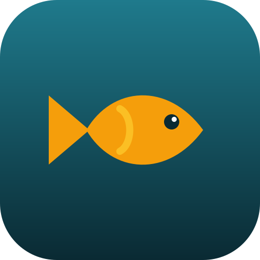
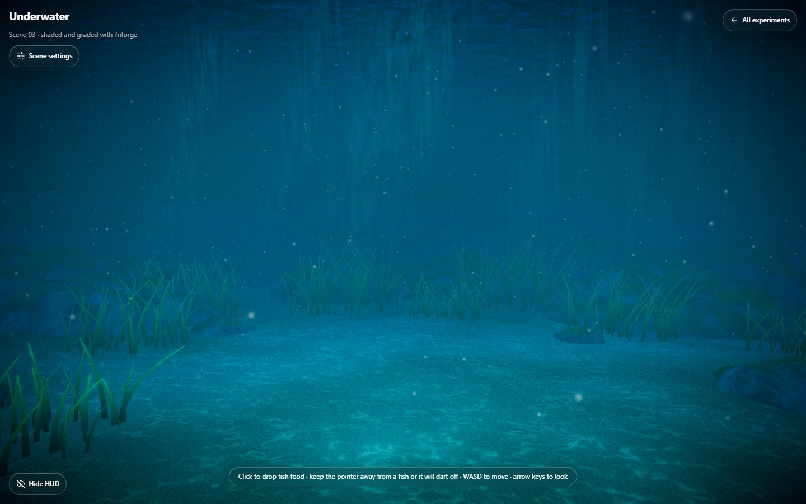
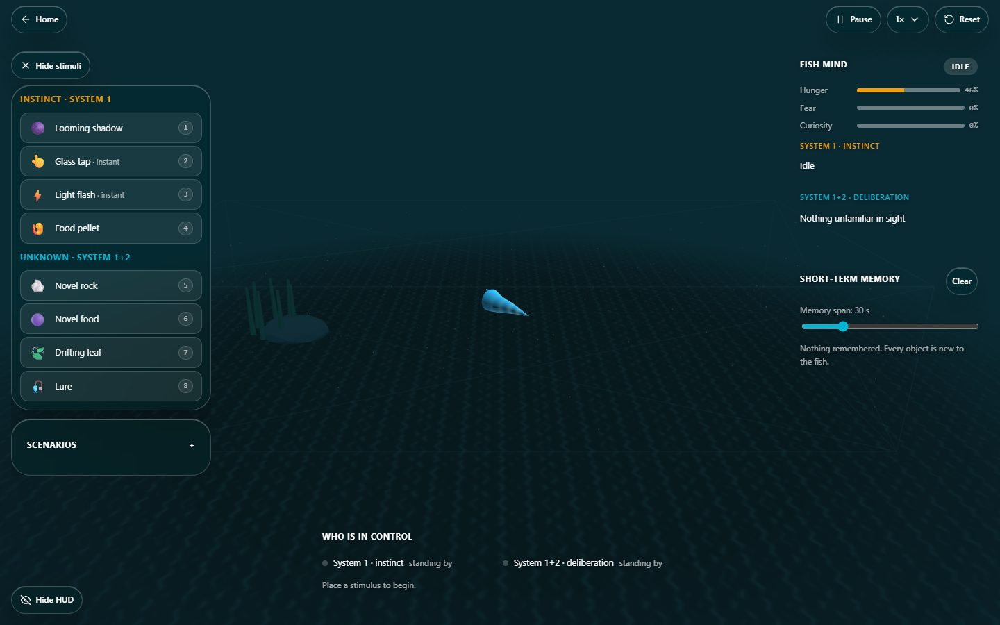
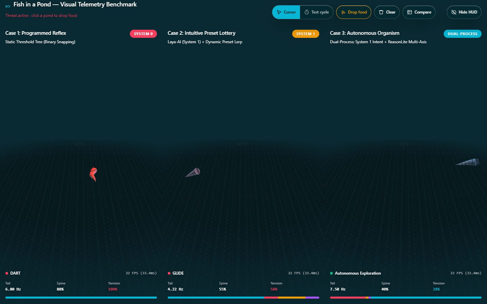

<div align="center">



# Fish Pond

**Interactive 3D fish behaviour experiments that run entirely in your browser.**

A cognitive arena, a three-way controller benchmark and a realistic Triforge-shaded underwater scene, wrapped in a Liquid Glass interface.

[](https://fish-pond-mu.vercel.app)
[](https://fish-pond-mu.vercel.app/docs)


[**Live demo**](https://fish-pond-mu.vercel.app) · [**Documentation**](https://fish-pond-mu.vercel.app/docs) · [**Report a bug**](https://github.com/AftabIbrahimKazi/fish-pond/issues/new?template=bug_report.md) · [**Request a feature**](https://github.com/AftabIbrahimKazi/fish-pond/issues/new?template=feature_request.md)



</div>

---

## Table of contents

- [What is Fish Pond?](#what-is-fish-pond)
- [The four pages](#the-four-pages)
- [Features](#features)
- [Controls](#controls)
- [Getting started](#getting-started)
- [Scripts](#scripts)
- [Project structure](#project-structure)
- [How it works](#how-it-works)
- [Tuning the underwater scene](#tuning-the-underwater-scene)
- [Design system](#design-system)
- [Accessibility](#accessibility)
- [Performance](#performance)
- [SEO and sharing](#seo-and-sharing)
- [Deployment](#deployment)
- [Known limits and roadmap](#known-limits-and-roadmap)
- [Documentation index](#documentation-index)
- [Contributing](#contributing)
- [Credits](#credits)

## What is Fish Pond?

Fish Pond is a set of browser experiments about how an artificial fish can decide what to do. It compares mechanical reflexes, probabilistic presets and continuous reasoning, and it shows the difference between *instinct* (System 1) and *deliberation* (System 1+2). Everything runs client-side with Next.js, TypeScript, Three.js and Triforge shader graphs: there is no backend, no account and no tracking.

It began as an implementation of an architectural benchmark specification (see [`project-statement/`](project-statement/fish_pond_benchmark_specification.md)) and grew into a small lab with a consistent visual language.

## The four pages

| Page | What it is | Try it |
|---|---|---|
| **`/`** Landing | The live underwater scene behind four glass cards | Click the water to feed the fish |
| **`/arena`** Cognitive Arena | One fish in a wide pond: instant reflexes versus slow appraisal of unknown objects, with visible short-term memory | Place stimuli, watch the Fish Mind readout |
| **`/benchmark`** Visual Telemetry Benchmark | Three controllers side by side, fed identical inputs, with live telemetry | Steer a threat with the cursor, run the test cycle |
| **`/underwater`** Underwater | A realistic goldfish scene with a settings sidebar, free camera and touch pads | Tune about 60 graphics settings, fly with WASD |
| **`/docs`** Documentation | The full, deep-dive documentation, shown on the site | Read how every system works |

<p align="center">
  
  
</p>

## Features

### Cognitive Arena
- Eight stimuli (shadow, glass tap, light flash, food, novel rock, novel food, leaf, lure) with hotkeys `1`-`8`.
- **System 1** reacts to known stimuli in 80-120 ms through a weighted lottery of designer presets.
- **System 1+2** appraises unknown objects in five phases (notice, approach, inspect, probe, verdict) taking 0.7-4.5 s depending on novelty.
- An **arbiter** lets instinct always win, aborts deliberation and locks System 2 out for 2.5 s.
- **Short-term memory** with an adjustable span (5-120 s) and four scripted scenarios.

### Visual Telemetry Benchmark
- Case 1 programmed reflex, Case 2 preset lottery, Case 3 dual-process reasoning.
- A shared telemetry bus, seeded randomness and identical safety clamping keep the comparison fair.
- A 16-second automated test cycle and an interactive cursor threat.
- A comparison matrix that opens from the **Compare** chip.

### Underwater scene
- Every custom material is a Triforge node graph (no hand-written GLSL): sand, rocks, seagrass, dome, water surface, light shafts and fish shadows.
- Beer-Lambert water absorption, caustics, dappling, marine snow, bloom, colour grade, vignette and film grain.
- Three goldfish with personalities, food that sinks and is eaten, cursor-aware fleeing and a live behaviour readout.
- A **Scene settings** sidebar with 62 settings, typed values, JSON export and reset.
- WASD + arrow-key navigation and on-screen touch pads.

### Interface
- Liquid Glass overlays over the canvas, a Hide HUD button on every experiment, soft page transitions and a fully responsive layout.

## Controls

| Input | Action |
|---|---|
| Mouse move | Camera parallax; fish near the cursor ray flee |
| Click / tap water | Drop fish food |
| `W` `A` `S` `D` | Move (underwater) |
| Arrow keys | Turn and look (underwater) |
| Touch pads | Move and Look on phones and touch screens (underwater) |
| `1`-`8`, `Esc`, `Space`, `R` | Choose stimulus, cancel, pause, reset (arena) |

## Getting started

**Prerequisites:** Node.js 20 or newer (tested on 24) and npm 10 or newer. A browser with WebGL 2.

```bash
git clone --recurse-submodules https://github.com/AftabIbrahimKazi/fish-pond.git
cd fish-pond
npm install
npm run dev
```

Open <http://localhost:3000>. The `--recurse-submodules` flag pulls `ai-dev-kit`, a development-only skills library; the app does not need it to build.

Optional environment variable:

| Variable | Default | Purpose |
|---|---|---|
| `NEXT_PUBLIC_SITE_URL` | `https://fish-pond-mu.vercel.app` | Base URL used for canonical links, the sitemap, robots and social previews |

## Scripts

| Command | What it does |
|---|---|
| `npm run dev` | Start the development server |
| `npm run build` | Production build (static pages) |
| `npm run start` | Serve the production build |
| `npm run lint` | Run ESLint (use `npx eslint src` to lint only the app) |
| `npx tsc --noEmit` | Type-check the project |

## Project structure

```text
fish-pond/
├── docs/                   Markdown documentation and README images
├── project-statement/      The original benchmark specification
├── public/                 Goldfish models, icons, social previews, llms.txt
├── src/
│   ├── app/                Routes, global CSS, design tokens, sitemap, robots, manifest
│   ├── components/         Shared UI and per-experiment components
│   ├── config/             Site constants and SEO builders
│   ├── simulation/         Arena, benchmark controllers and the underwater engine
│   └── types/              Shared types
├── coding-standards/       Layered coding standards (CSS, HTML, TS, SEO, a11y, QA)
└── ai-dev-kit/             Development skills library (git submodule)
```

See [docs/architecture.md](docs/architecture.md) for a guided tour.

## How it works

- **Engine per route.** Each WebGL scene is owned by one class (`UnderwaterEngine`, the arena controller, a pond environment per benchmark viewport) that is created on mount and destroyed on navigation.
- **Triforge everywhere on the underwater scene.** Shading is expressed as node graphs; a compositor chain grades the final frame.
- **Settings pipeline.** Each setting is applied *live*, by recompiling materials, or by rebuilding the compositor, with a short debounce for the latter two.
- **Deterministic simulations.** Randomness is seeded; the arena and benchmark controllers are TypeScript simulations, not machine-learning models.

Read more: [architecture](docs/architecture.md), [fish AI](docs/fish-ai.md), [controls](docs/controls.md).

## Tuning the underwater scene

1. Open `/underwater` and press **Scene settings**.
2. Adjust sliders or type exact values. Colours use a picker.
3. Press **Export JSON** to download `fish-pond-underwater-settings.json`.
4. Paste its `settings` object over `SCENE_DEFAULTS` in `src/simulation/underwater/underwater-settings.ts` to make the values the new defaults.

Details and the full settings list: [docs/scene-settings.md](docs/scene-settings.md).

## Design system

Liquid Glass: frosted translucent panes over imagery, white text in two weights, hairline dividers and pill controls. Tokens are prefixed `--fp-` and live in `src/app/variables.css`; custom classes use the `fp-` signature. Glass appears only over the canvas, with stronger fallbacks for unsupported blur and reduced transparency. See [docs/design-system.md](docs/design-system.md).

## Accessibility

Keyboard-operable controls with visible focus rings, 40 px hit areas, labelled icon buttons, a listbox-style dropdown, reduced motion and reduced transparency support, and one `h1` per page with a sequential heading order.

## Performance

Adaptive pixel ratio, scenes that pause when off-screen, throttled React telemetry, stable layouts and a landing page that reveals the water before loading the 12 MB of goldfish models. Real-GPU measurements are still to do; see [Known limits](#known-limits-and-roadmap).

## SEO and sharing

Unique titles and descriptions, canonical URLs, Open Graph and Twitter cards with a per-page 1200 by 630 preview, JSON-LD (WebSite, WebApplication, BreadcrumbList, TechArticle, ItemList), a generated sitemap and robots file, a web app manifest, favicons, `llms.txt`, `security.txt` and security headers. See [docs/seo.md](docs/seo.md).

## Deployment

The site is a static Next.js build and deploys to Vercel with no configuration. Set `NEXT_PUBLIC_SITE_URL` to your domain. Full steps in [docs/deployment.md](docs/deployment.md).

## Known limits and roadmap

- Not yet measured on real GPUs (frame rate, benchmark cycle, arena).
- The benchmark cursor threat has no keyboard equivalent.
- The environment reflection map is baked once at load, so changing the water colour needs a reload to update reflections.
- Rocks have no collision for the free camera.
- ONNX models for benchmark Cases 2 and 3 are planned; controllers are deterministic until then.
- Next: System 2 deliberation for the underwater fish, more feeding animation, touch feeding in the benchmark.

## Documentation index

| Document | Covers |
|---|---|
| [docs/architecture.md](docs/architecture.md) | Modules, data flow, engines |
| [docs/fish-ai.md](docs/fish-ai.md) | Arena, benchmark and underwater behaviour systems |
| [docs/scene-settings.md](docs/scene-settings.md) | The settings sidebar and JSON workflow |
| [docs/controls.md](docs/controls.md) | Mouse, keyboard and touch |
| [docs/design-system.md](docs/design-system.md) | Tokens, glass rules, CSS conventions |
| [docs/seo.md](docs/seo.md) | Metadata, structured data, previews |
| [docs/deployment.md](docs/deployment.md) | Build, Vercel and environment |
| [CHANGELOG.md](CHANGELOG.md) | Version history |
| [CONTRIBUTING.md](CONTRIBUTING.md) | How to contribute |
| [SECURITY.md](SECURITY.md) | Reporting vulnerabilities |
| [handover.md](handover.md) | Current project state for the next session |

## Contributing

Issues and pull requests are welcome. Read [CONTRIBUTING.md](CONTRIBUTING.md) and the [code of conduct](CODE_OF_CONDUCT.md) first. The project follows layered coding standards in [`coding-standards/`](coding-standards/index.md).

## Credits

Built by [Aftab Ibrahim Kazi](https://github.com/AftabIbrahimKazi) with Next.js, React, Three.js, the Triforge shader and compositor packages and Strata CSS. The goldfish models ship in `public/`; confirm their licences before redistributing them. No licence file has been chosen for the source yet, so all rights are reserved until one is added.
