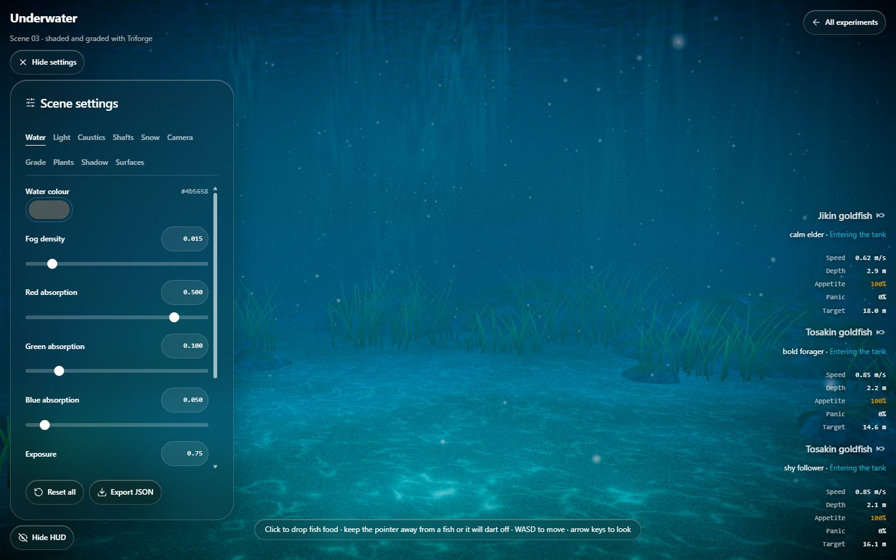

# Scene settings

The **Scene settings** sidebar on `/underwater` lets you tune every graphics detail of the scene. The full table of all 62 settings, their ranges and defaults is in [scene-settings-reference.md](scene-settings-reference.md).



## Using the sidebar

- Press **Scene settings** (top-left) to open it and **Hide settings** to close it.
- Pick a tab: Water, Light, Caustics, Shafts, Snow, Camera, Grade, Plants, Shadow, Surfaces.
- Drag a slider, or type an exact value in the box beside it. Typed values are clamped to the slider range.
- Colour settings use the browser colour picker.
- **Reset all** restores the shipped defaults. **Export JSON** downloads every value.

Your tuning is remembered in the browser (local storage) between visits.

## How changes are applied

| Mode | Behaviour | Typical settings |
|---|---|---|
| Live | Immediate | Exposure, fog density, sun, ambient, rim and fill lights, camera, snow, seagrass sway |
| Materials | Triforge graphs are recompiled after 250 ms of quiet | Water colour, absorption, caustics, shaft intensity, bump and caustic gain |
| Grade | The compositor is rebuilt after 250 ms of quiet | Bloom, vignette, grain, lift, gain, saturation |

Materials and Grade changes cause a brief hitch while shaders compile; that is expected.

## Exported file

```json
{
  "scene": "underwater",
  "version": 1,
  "settings": {
    "fogColor": "#4b5658",
    "fogDensity": 0.015
  }
}
```

(The real file contains all 62 keys.)

## Making values the new defaults

1. Export the JSON.
2. Open `src/simulation/underwater/underwater-settings.ts`.
3. Replace the values inside `SCENE_DEFAULTS` with the `settings` object from the file.
4. Rebuild. Browsers that stored older tuning ignore it automatically, because the stored copy records the defaults it was made against.

## Notes

- Triforge sun and ambient scaling uses fixed reference intensities (`TRIFORGE_SUN_REFERENCE_INTENSITY = 3.1`, `TRIFORGE_AMBIENT_REFERENCE_INTENSITY = 0.7`). Do not change them when adopting new defaults.
- The environment reflection map is baked once at load, so a new water colour only affects reflections after a reload.
- Fish behaviour, terrain shape and scenery placement are not exposed yet.
